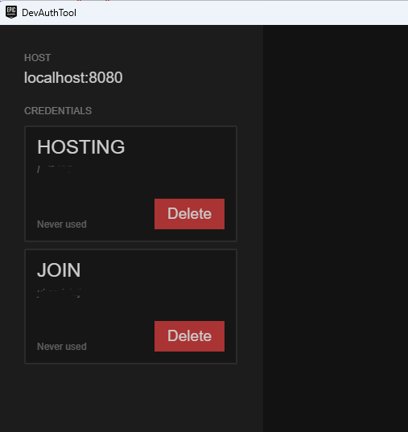

[eos_console_test](https://github.com/y-horiuchi-snd/eos_console_test)に、P2P用のコードを実装し、簡単なP2P通信をしてみよう、といった趣旨のforkです

- [はじめに](#はじめに)
- [オリジナルからの変更点](#オリジナルからの変更点)
- [DevAuthToolの使い方](#devauthtoolの使い方)
  - [概要](#概要)
  - [できること](#できること)
  - [今回の使い方](#今回の使い方)
- [動作内容](#動作内容)

# はじめに

  サンプルが複雑になりすぎるので、

  fork前のものはなるべくシンプルな状態にしていたのですが、

  DevAuthToolを前提で複数のアプリを立ち上げて自動的にログイン状態とし、

  ロビーへの参加、

  簡単なP2P管理部分の実装

  といった内容を元のプロジェクトに対して追加したものです

  注意：マッチングホスト側と参加側で二名分、Epicアカウントが必要になります、事前に作成しておいてください

# オリジナルからの変更点

- マッチングホスティング側と参加側でプロジェクトを分離

  異なる部分のみをif文で分岐させて、共通処理で動作させてもいいのですが、

  動作順序が見づらいので分離しました

  それぞれのプロジェクトのmain()が上から順に実行されるだけなので、順に追いかけてください。

- デバッグ時はDevAuthTool前提としてデバッグ中は認証を自動化

  ログイン大変なので、DevAuthToolで事前にログインしたものを固定の名前で使います。

  DevAuthToolのポートは8080で、マッチングホスト側はHOSTING、参加側はJOINという名前で事前に登録しておいてください

  （DevAuthToolはそろそろ保存機能を実装しても怒られないのではないか、と思います！）

- P2P処理の実装

  ロビーからのEOS_LMS_JOINEDなどを利用して

  P2Pのマッチング状態を作成します

  初期化、通信許可、開通のためのパケット送受信と相互確認、接続後は定期的に通信を行う、といった流れが簡易に実装されています

# DevAuthToolの使い方

## 概要

  DevAuthToolはSDK内に入っています、

  SDK\Tools\EOS_DevAuthTool-win32-x64-1.1.0.zip

  が該当アプリケーションです

  DevAuthToolはEpicアカウントのログイン処理を代行（というか維持）してくれるツールです

  ゲームを起動するたびにログインするのは非常に大変なので、

  DevAuthToolでログインしておいて、維持されているトークンをかすめ取り、

  そのトークンを使ってログインし自分のアプリケーションのデバッグを行う、といったツールになっていると思われます

  （注意：DevAuthToolの公式な資料を見つけられていないので、触った感触だけで適当なことを書いています）

## できること

  DevAuthToolを起動し、デバッグで使用するユーザーでログインし、そのユーザーに名前を付けることで、

  EOS_LCT_DeveloperとDevAuthToolが起動しているIPとポート、ユーザーに付けた名前、を使って二段階認証などをすっとばしてデバッグ出来るようになります

  ビルドやデバッグ機材固有の情報をキーにすれば、入力をすべて飛ばしてデバッグを行うことも出来るようになります

## 今回の使い方

  DevAuthToolを起動し、ポート番号を8080に設定します

  ログインを選び、Epicアカウントにログインし、「HOSTING」と名前を付けます

  再びログインを選び、Epicアカウントにログインし、「JOIN」と名前を付けます

  

  これで準備は完了となります

# 動作内容

  TODO hosting側とjoin側の動作説明できればと

