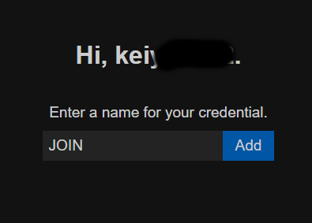

[eos_console_test](https://github.com/y-horiuchi-snd/eos_console_test)にP2P用のコードを実装し、簡単なP2P通信をしてみよう、といった趣旨のforkです

- [はじめに](#はじめに)
- [オリジナルからの変更点](#オリジナルからの変更点)
- [DevAuthToolの使い方](#devauthtoolの使い方)
  - [マニュアル](#マニュアル)
  - [概要](#概要)
  - [できること](#できること)
  - [今回の使い方](#今回の使い方)
- [動作内容](#動作内容)

# はじめに

  サンプルが複雑になりすぎるので、

  fork前のものはなるべくシンプルな状態にしていたのですが、

  DevAuthToolを前提で複数のアプリを立ち上げて自動的にログイン状態とし、

  ロビーへの参加、

  簡単なP2P管理部分の実装

  といった内容を元のプロジェクトに対して追加したものです

  注意：マッチングホスト側と参加側で二名分、Epicアカウントが必要になります、事前に作成しておいてください

# オリジナルからの変更点

- マッチングホスティング側と参加側でプロジェクトを分離

  異なる部分のみをif文で分岐させて、共通処理で動作させてもいいのですが、

  動作順序が見づらいので分離しました

  それぞれのプロジェクトのmain()が上から順に実行されるだけなので、順に追いかけてください。

- デバッグ時はDevAuthTool前提としてデバッグ中は認証を自動化

  ログイン大変なので、DevAuthToolで事前にログインしたものを固定の名前で使います。

  DevAuthToolのポートは8080で、マッチングホスト側はHOSTING、参加側はJOINという名前で事前に登録しておいてください

  （DevAuthToolはそろそろ保存機能を実装しても怒られないのではないか、と思います！）

- P2P処理の実装

  ロビーからのEOS_LMS_JOINEDなどを利用して

  P2Pのマッチング状態を作成します

  初期化、通信許可、開通のためのパケット送受信と相互確認、接続後は定期的に通信を行う、といった流れが簡易に実装されています

# DevAuthToolの使い方

## マニュアル

  [DevAuthTool](https://dev.epicgames.com/docs/ja/epic-account-services/developer-authentication-tool)

## 概要

  DevAuthToolはSDK内に入っています、

  SDK\Tools\EOS_DevAuthTool-win32-x64-1.1.0.zip

  が該当アプリケーションです

  DevAuthToolはEpicアカウントのログイン処理を代行（というか維持）してくれるツールです

  ゲームを起動するたびにログインするのは非常に大変なので、

  DevAuthToolでログインしておいて、維持されているトークンをかすめ取り、

  そのトークンを使ってログインし自分のアプリケーションのデバッグを行う、といったツールになっていると思われます

## できること

  DevAuthToolを起動し、デバッグで使用するユーザーでログインし、そのユーザーに名前を付けることで、

  EOS_LCT_DeveloperとDevAuthToolが起動しているIPとポート、ユーザーに付けた名前、を使って二段階認証などをすっとばしてデバッグ出来るようになります

  ビルドやデバッグ機材固有の情報をキーにすれば、入力をすべて飛ばしてデバッグを行うことも出来るようになります

## 今回の使い方

  DevAuthToolを起動し、ポート番号を8080に設定します

  登録を二つ作っていますが、違うアカウントを用意し、それぞれログインする必要があります。

  ログインを選び、Epicアカウントにログインし、「HOSTING」と名前を付けます

  

  再びログインを選び、Epicアカウントにログインし、「JOIN」と名前を付けます

  

  両方ログインが完了すると、ツールの左側が↓のようになります

  

  これで準備は完了となります

# 動作内容

- マッチング主催者側（eos_console_test）

  EOSを初期化、DevAuthTool経由で"HOSTING"という名前で認証し、ロビーを作成し待機する

  ロビーの属性には、"now"という日時情報を付与し、一番新しいロビーがわかるようにしています、

  これは、デバッガで強制的に終了するなどでロビーをつぶした場合、サーバに残り続けてしまうという問題対策も兼ねています

  （一番最新のものが識別できるので、デバッグ中に間違って参加しないようにできる）

  ロビーでは誰かが参加してくると、EOS_ELobbyMemberStatus::EOS_LMS_JOINEDが発火し、

  P2P::OnJoined() へ参加者情報が届きます

  P2P::OnJoinedではその情報を元に、「P2P::Link」を作成し、EOS_P2P_AcceptConnectionを行います。

  P2P::Update では有効なP2P::Linkの定点動作を行っています

  P2P::Linkの定点動作の役割は主に２つあり、

  - ESTABLISHED_LEVEL::WAKEUP -> ESTABLISHED_LEVEL::ALREADY_WAKEUP という通信を相互に行う、

  - 通信確認が終わったら待機状態に入る
  
  のふたつを行います（Link::Update()の部分になります）

  最初に相互通信の確立確認を行っているのは、

  相手側通信を受け入れるまで通信が行われず、
  
  到達したか不明瞭な状態となってしまいます、これを防ぐ目的です

  このタイミングはRUDPでも届かないようなので、儀式だと思ってやっておきましょう。

  接続が確立した後は、定期的に通信を行い接続が継続していることを確認しておきます

<details><summary>動作ログ（折りたたまれています）</summary><div>

```text
Initialize
Authorize
Connect
LobbyCreate
LobbySetAttributes
wait(break ctrl+c)
EOS_LMS_JOINED
STATE::WAKEUP
Wake
STATE::WAKEUP
Wake
STATE::WAKEUP
Wake
STATE::WAKEUP
Wake
STATE::WAKEUP
Wake
STATE::WAKEUP
Wake
STATE::WAKEUP
Wake
STATE::WAKEUP
Wake
STATE::WAKEUP
Wake
STATE::WAKEUP
Wake
STATE::WAKEUP
Wake
STATE::WAKEUP
Wake
STATE::WAKEUP
Wake
STATE::WAKEUP
Wake
Keepalive
received 00022d5ff:12:12
Keepalive
received 00022d5ff:13:12
Keepalive
received 00022d5ff:14:12
STATE::WAKEUP
Wake
Keepalive
received 00022d5ff:15:12
STATE::WAKEUP_ACK
Wake
Keepalive
received 00022d5ff:16:12
STATE::WAKEUP_ACK
Wake
Keepalive
received 00022d5ff:17:12
KEEPALIVE(POST)
Keepalive
received 00022d5ff:18:12
KEEPALIVE(POST)
Keepalive
received 00022d5ff:19:12
KEEPALIVE(POST)
Keepalive
received 00022d5ff:20:12
KEEPALIVE(POST)
Keepalive
received 00022d5ff:21:12
KEEPALIVE(POST)
Keepalive
received 00022d5ff:22:12
KEEPALIVE(POST)
Keepalive
received 00022d5ff:23:12
KEEPALIVE(POST)
Keepalive
received 00022d5ff:24:12
KEEPALIVE(POST)
Keepalive
received 00022d5ff:25:12
EOS_LMS_LEFT
```

</div></details>


- マッチング参加者側（eos_console_test_join）

  EOSを初期化、DevAuthTool経由で"JOIN"という名前で認証します

  次に参加するロビーを探すのですが、EOS_EComparisonOp::EOS_CO_DISTANCEを使い、
  
  一番新しいもの順にソートして、0番目のロビーへ参加します、

  参加時にすでに参加済みのユーザーに対して P2P::OnJoined() を行い、「P2P::Link」を作成します

  この後は、ホストでの動作とほぼ同じ流れでの処理が行われます

  双方で、EOS_P2P_AcceptConnectionを行い、相互に通信を開始することで相互通信が確立できます。

<details><summary>動作ログ（折りたたまれています）</summary><div>

```text
  Initialize
Authorize
Connect
wait(10000ms)(break ctrl+c)
search 1
index:0[
 NOW 1703125307976
 TEST 1
]
LobbyJoin
wait
wait(45000ms)(break ctrl+c)
STATE::WAKEUP
Wake
STATE::WAKEUP
Wake
STATE::WAKEUP
Wake
STATE::WAKEUP
Wake
STATE::WAKEUP
Wake
STATE::WAKEUP
Wake
STATE::WAKEUP
Wake
STATE::WAKEUP
Wake
STATE::WAKEUP
Wake
STATE::WAKEUP
Wake
STATE::WAKEUP
Wake
STATE::WAKEUP
Wake
STATE::WAKEUP
Wake
STATE::WAKEUP
Wake
Keepalive
received 00024b70:17:12
STATE::WAKEUP
Wake
Keepalive
received 00024b70:18:12
STATE::WAKEUP_ACK
Wake
Keepalive
received 00024b70:19:12
KEEPALIVE(POST)
Keepalive
received 00024b70:20:12
KEEPALIVE(POST)
Keepalive
received 00024b70:21:12
KEEPALIVE(POST)
Keepalive
received 00024b70:22:12
KEEPALIVE(POST)
Keepalive
received 00024b70:23:12
KEEPALIVE(POST)
Keepalive
received 00024b70:24:12
KEEPALIVE(POST)
Keepalive
received 00024b70:25:12
KEEPALIVE(POST)
Keepalive
received 00024b70:26:12
KEEPALIVE(POST)
Keepalive
received 00024b70:27:12
LobbyLeave
KEEPALIVE(POST)
Hello World!
```

</div></details>
